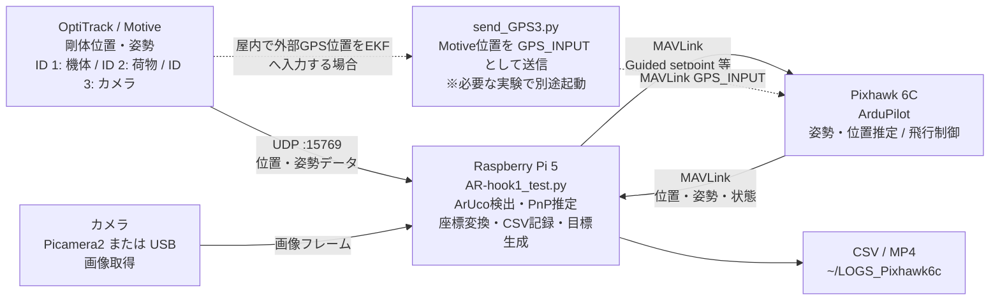
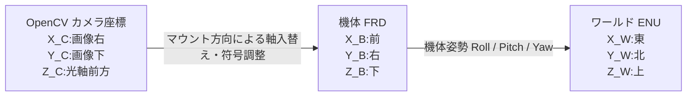
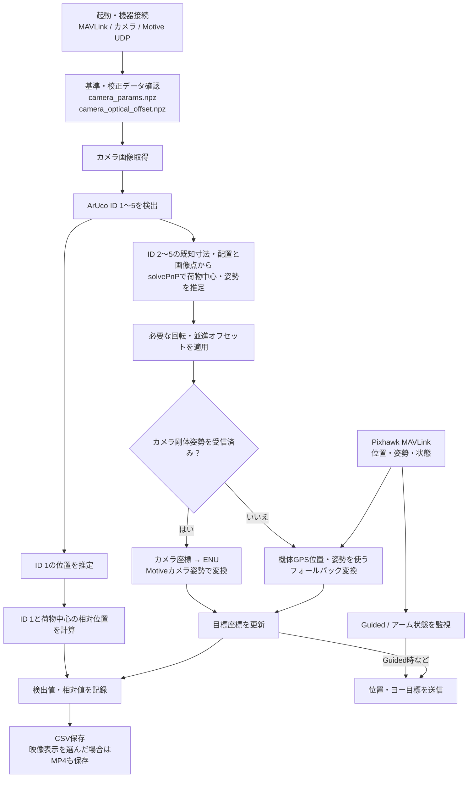

# AR-Hook システム構成・位置計測・実験座標ガイド

## 1. システム構成

### 構成要素と役割

| 要素 | 実装上の役割 | 
|---|---|
| カメラ | Picamera2を優先し、利用できない場合はUSBカメラを開く。画像からArUcoを検出する。 | 
| ArUcoマーカー | ID 1を機体／手先側、ID 2〜5を荷物の4頂点として使う。マーカー一辺はコード上4 cm、荷物枠は15 cm四方。 | 
| Motive | UDP 15769で剛体データを送る。コードは機体(ID 1)、荷物(ID 2)、カメラ(ID 3)を扱う。 | 
| Raspberry Pi 5 | 画像処理、座標変換、MAVLink通信、記録を実行する。 | 
| Pixhawk 6C | ArduPilotの状態取得およびGuided目標受信を担う。 | 
| `send_GPS3.py` | Motive位置を `GPS_INPUT` としてPixhawkへ注入する補助ブリッジ。メインスクリプトから自動起動されない。 | 

## 2. 座標系と図の読み方

### 2.1 ワールド座標と機体座標

ワールドENU軸は地面に固定され、機体FRD軸は機体とともに回転する。したがって機体の向き（ヨー）が変われば、機体の前方・右方と東・北との対応も変わる。

### 2.2 カメラ座標との対応

OpenCVカメラ座標は `X_C=画像右、Y_C=画像下、Z_C=光軸前方`。これは機体FRDとは別の座標系である。

| カメラ取り付け | カメラ座標から機体FRDへの対応（コード上） |
|---|---|
| 前向き (`front`) | `X_B = Z_C`、`Y_B = X_C`、`Z_B = Y_C` |
| 下向き (`down`) | `X_B = -Y_C`、`Y_B = X_C`、`Z_B = Z_C` |

前向きカメラの対応はスクリプトのコメントと変換行列に基づく。Motiveカメラ剛体を使う場合は、マウント方向の軸変換、姿勢回転、光学中心オフセットを合成してカメラ座標からENUへ変換する。カメラ剛体データが未受信の場合は、機体位置・姿勢を使う経路へフォールバックする。

### 2.3 荷物マーカー座標

ID 2〜5のマーカー位置は、荷物中心を原点とする平面上に置かれる。コードでは一辺15 cmの正方形の各頂点に配置し、各マーカーの一辺を4 cmとしてPnP推定に使用する。

このローカル図はマーカーIDの「右上・左上・左下・右下」というコード上の配置を示す。面が水平か垂直かによって、ローカルX/Y/Zとワールド東・北・上の対応は変わる。
## 3. 位置計測の処理手順

### 計測の段階

1. **機器・通信を確認する**  
   カメラ、PixhawkとのMAVLink、MotiveのUDP配信を確認する。スクリプト起動時に接続方法、姿勢ソース、映像表示を選択する。
2. **内部パラメータを読み込む**  
   `camera_params.npz` があればカメラ行列・歪み係数として使用する。ファイルがない場合はスクリプト内の既定値を使うため、実験記録にどちらを使ったか残す。
3. **画像から位置を推定する**  
   ID 2〜5の検出コーナーと既知のマーカー配置・寸法から `solvePnP` で荷物中心と姿勢を推定する。ID 1から機体／手先側マーカー位置を推定する。
4. **座標を変換する**  
   カメラ剛体データがあればカメラ姿勢に基づいてENUへ変換する。受信できないときは機体位置・姿勢を使うフォールバック経路となる。ログの `Coord_Source` を確認する。
5. **相対位置と目標を計算する**  
   ID 1と荷物中心の位置関係を算出し、検出結果から目標を更新する。ID 1が見えない場合、相対位置は算出できず、荷物中心を目標とする処理になる。
6. **記録を確認する**  
   CSVは `~/LOGS_Pixhawk6c` に保存される。映像表示を有効にするとMP4も記録される。検出フラグ、座標変換ソース、欠損値がないかを実験後に確認する。

### 実験前の共通位置合わせ

Motiveのrigid body作成前に、カメラを北向きに配置し、荷物および手先マーカーの正面が南を向くように位置合わせする。この位置合わせの後、水平実験と垂直実験を行う。

## 4. 水平実験の座標図（床面上に立てたマーカー）

水平実験では、マーカー面を床などの**水平面上に立てて**設置し、カメラで撮影する。マーカー面は垂直で、面内の一軸（例では `Y_L`）がワールド上方向、面内のもう一軸（`X_L`）が床面内の水平方向になる。面法線 `Z_L` も水平方向を向く。

水平実験で主に確認すること:

- マーカー面内の上下変位は `Y_L` とワールド `Z_W` の変化に対応するか。
- 面内の左右変位は `X_L` と、設置方位に対応するENU水平成分の変化に対応するか。
- 面から近づく／遠ざかる動きは面法線 `Z_L` とそのワールド水平成分に現れるか。

## 5. 垂直実験の座標図（寝かせたマーカーを上空から撮影）
5
垂直実験では、マーカーを**寝かせて水平面上に置き**、上空のカメラから撮影する。マーカー面は水平となるため、面内の2軸（`X_L`, `Y_L`）は床面内、面法線 `Z_L` は鉛直方向になる。カメラは上空からマーカー面を見る下向き配置である。

この配置例では、面内の `X_L` と `Y_L` が水平面内、面法線 `Z_L` が上向き（`+Z_W`）となる。ただし、マーカーの表裏やローカル座標の定義によって法線が下向きになる場合があるため、実物とPnPで定義した向きを確認する。
垂直実験で主に確認すること:

- 上空画像の左右・上下（カメラ画像 `X_C`, `Y_C`）と、床面内のマーカー軸 `X_L`, `Y_L` の対応。カメラの回転・設置方位によって軸の符号や対応が変わる。
- マーカー面内の移動はENUの東・北方向のどの成分に対応するか。
- 面から離れる方向は鉛直成分となる。カメラ光軸とマーカー面法線の正方向を混同しない。

## 6. 水平・垂直実験の比較

| 項目 | 水平実験（例） | 垂直実験（例） |
|---|---|---|
| 対象マーカー面 | 水平床面上に立てる（面は垂直） | 床面上に寝かせる（面は水平） |
| カメラ | マーカー面を正面から撮影（向きは実験配置による） | 上空から下向きに撮影 |
| 面法線 | 水平面内 | 鉛直方向 |
| 主に比較するワールド成分 | 面内上下はENU上、面内横と法線はENU水平成分 | 面内2軸はENU水平成分、法線はENU上 |
| 事前に記録する設置情報 | `+X_L` 方位、`+Y_L` 上下、表側法線、カメラ位置 | `+X_L` と `+Y_L` の方位、表側法線、上空カメラの向き |
| 特に注意する点 | 面内上方向とENU上、面法線の方位 | `'down'` カメラ設定、画像軸と床面軸の対応、法線符号 |

